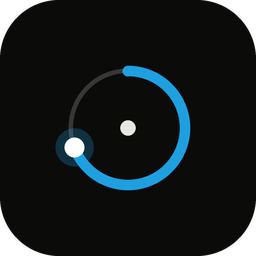
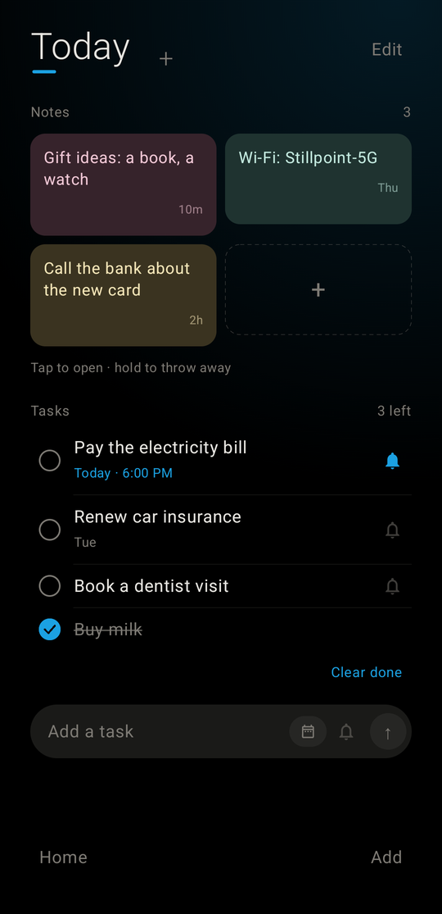
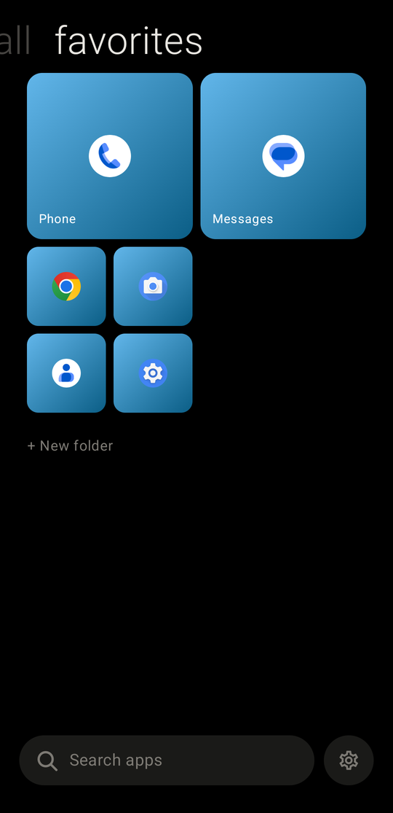
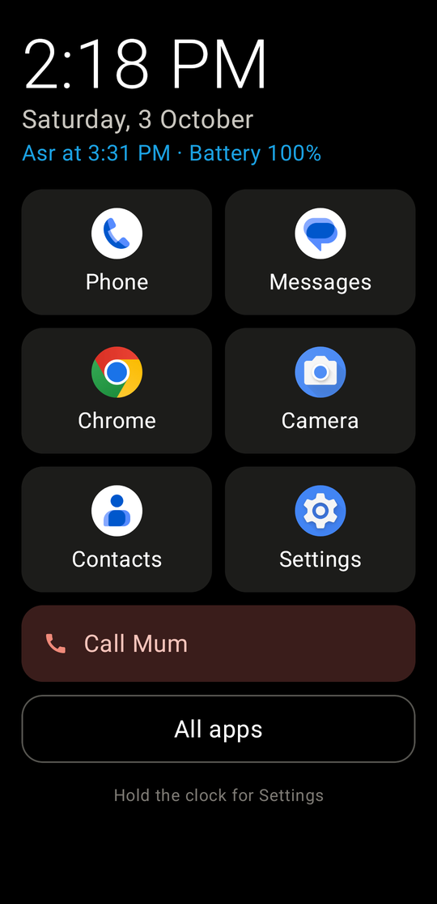
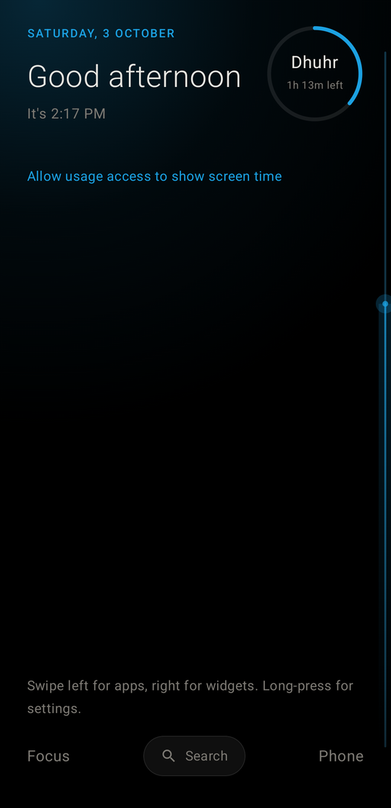
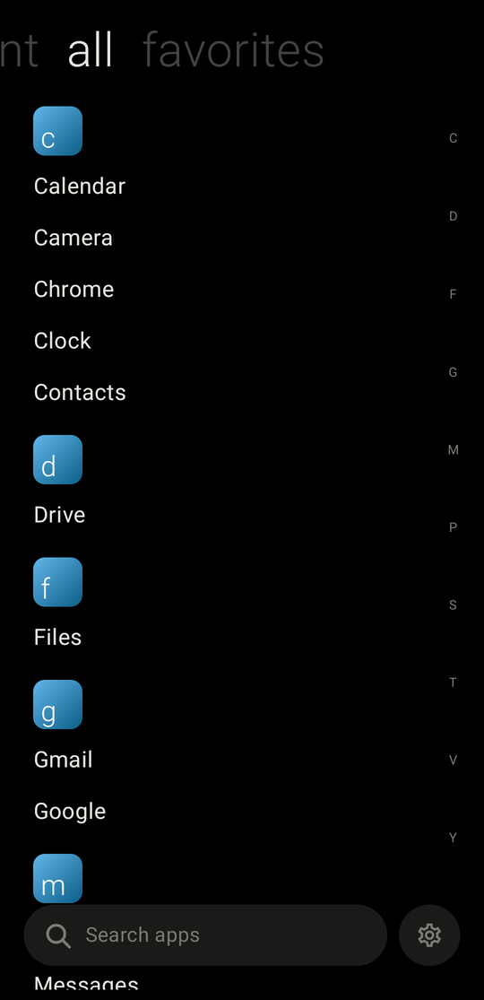
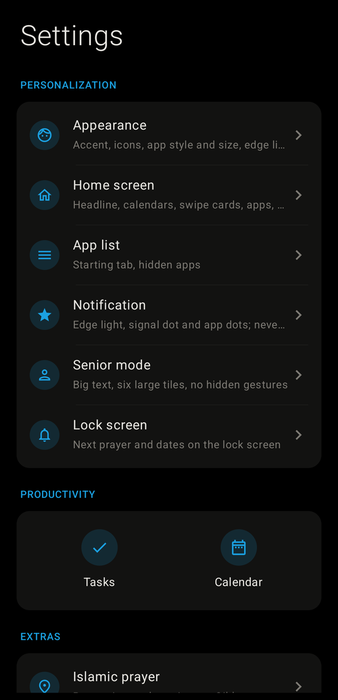

<h1 align="center">Stillpoint Launcher</h1>

A calm, minimal home screen for Android. One important thing at a time.

  
  
  
  

  <a href="https://github.com/cloudit24/stillpoint/releases/latest/download/Stillpoint-Launcher.apk"><b>⬇ Download the latest APK</b></a>
  &nbsp;·&nbsp;
  <a href="CHANGELOG.md">All versions</a>

  
  
  

  
  
  

---

## Download and install

1. **[Download Stillpoint-Launcher.apk](https://github.com/cloudit24/stillpoint/releases/latest/download/Stillpoint-Launcher.apk)** on your phone (Android 8.0 or newer).
2. Open it. If Android asks, allow your browser to install apps.
3. Press Home, pick **Stillpoint Launcher**, choose **Always**.

After that, updates come inside the app: **Settings → Updates**, with a notice when a new version is out.
Every older version is listed in the **[changelog](CHANGELOG.md)** and on the **[Releases](https://github.com/cloudit24/stillpoint/releases)** page, newest first.

## What it does

**Home**
- A headline that flips between the time, screen time, weather and the Hijri and Tamil dates.
- A clean ring beside it: the current prayer and the time left, or battery, or time left today.
- A terminal display above your apps: the one place Stillpoint talks to you. Iqama, missed calls,
  low battery, focus, your next event, your screen time, most pressing first. Tap a line to act.
  Terminal, Retro LCD or a quiet line, and you choose the topics.
- Your choice of calendar, battery and network under the headline; pinned apps below.
- Every swipe, double-tap and bottom shortcut can open any app or action.
- Home is a fixed frame: new things never push others off the screen ([design rules](docs/DESIGN.md)).

**The Shelf** (swipe right)
- Sticky notes, Stillpoint cards and widgets from any app, side by side, resized and moved by dragging.

**Islamic prayer** (optional)
- Prayer times calculated on the phone, prayer and iqama alerts, a Qibla compass that ticks as you turn,
  the moon phase, and an edge light that shows the prayer time running out.
- A full-screen alert at the adhan and the iqama, even over the lock screen. In a meeting, Remind in 5 min,
  offered only while the iqama is still far enough away. A quiet heads-up before each prayer if you like.
- Friday in the UAE: the alert comes at Dhuhr time, with a countdown to Jumu'ah at 12:45. Elsewhere
  Friday follows Dhuhr. All of it works without internet.

**Focus and wellbeing**
- Focus profiles (Work, Prayer, Sleep, Family, or your own), each with its apps, a length and an optional
  daily schedule.
- Always-allowed apps you choose, for family and work emergencies.
- A few seconds' pause before apps that are hard to put down, daily limits per app, a screen-time goal,
  and a calm home without icons, times or dots.
- Optional stronger guard: the same pause and focus for apps opened from notifications.
- Calendar from the phone or a calendar link. Project Hub is coming as a separate app.

**Your look**
- Accent colours, grey or accent-tinted icons, five fonts, and Stillpoint widgets for any launcher.

## Private by design

No accounts, no analytics, no ads, no Google Play Services. Settings never leave the phone.
It goes online only for features you switch on, and **every address can be changed to your own**
(Settings → System → Online sources):

| Feature | Default source | What is sent |
|---|---|---|
| Weather and city search | [Open-Meteo](https://open-meteo.com) (open source) | The city's position, rounded to about 10 km |
| Gold price | Dubai City of Gold board, Swissquote spot, or your own address | Nothing about you |
| Currency rates | [Frankfurter](https://frankfurter.dev) (open source) | A currency code |
| Public IP | [ipify](https://www.ipify.org) (open source) | Nothing |
| Updates | GitHub Releases | Nothing |
| Calendar link | Your own server | Nothing |

Prayer times, Qibla, moon phase and dates are calculated on the phone.

## Two builds

| Build | Where | Updates |
|---|---|---|
| `github` | This page | Inside the app |
| `fdroid` | F-Droid (planned) | Through F-Droid |

They are signed with different keys, so switching from one to the other needs an uninstall.

## Build from source

GitHub Actions builds both APKs on every push. Locally: open the folder in Android Studio and build the
`githubDebug` or `fdroidDebug` variant.

**Releasing:** bump `versionCode` and `versionName` in `app/build.gradle.kts`, add the version to
[CHANGELOG.md](CHANGELOG.md), commit, then push a tag `v<versionName>`. CI signs the APK and publishes the
release with that changelog section as its notes.

## Permissions

| Permission | Why |
|---|---|
| Usage access | Screen time, most used and recently used apps, data usage |
| Calendar | Today's events (optional) |
| Notifications | Prayer alerts, lock screen info, update notice (optional) |
| Exact alarms | Prayer and iqama alerts on the minute |
| Internet | Only the features above that you switch on |
| Install packages | `github` build only: installing an update you chose |
| Accessibility service | Double-tap to lock, swipe for notifications, and (only if Stronger guard is on) noticing which app opens; cannot read the screen |

## Known limits

- Focus and the pause cover apps opened from this launcher, unless Stronger guard is on.
- The background is plain black; wallpaper isn't shown.
- Gold prices don't include jewellery making charges.

## License

GPL-3.0, see [LICENSE](LICENSE). Fonts are under the SIL Open Font License ([docs/FONTS.md](docs/FONTS.md)).

Made by **[cloudit24](https://github.com/cloudit24)**.
